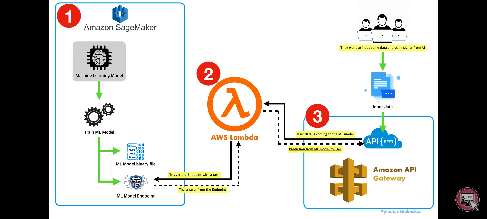

# Deep Learning Vision Models Deployment on AWS 

This project showcases the development and deployment of deep learning vision models using AWS services, aimed at achieving efficient training, optimization, and scalable model serving.

## Project Overview

- **Development and Deployment**:  development and deployment of deep learning vision models using AWS SageMaker
- **Scalable Infrastructure**: Utilized AWS Lambda and Amazon API Gateway to create a scalable and robust infrastructure for exposing models as RESTful APIs, facilitating seamless integration with various applications.
- **Model Optimization**: Employed NVIDIA TensorRT for model optimization and NVIDIA Triton Inference Server for high-performance model serving, achieving faster model inference capabilities.
- **Monitoring and Logging**: Implemented monitoring and logging via AWS CloudWatch, set up alerts via SNS, and configured scaling policies with SageMaker endpoints, to scale underlying instances for scalable model serving.

## Model Deployment Architecture

### Components

1. **AWS SageMaker**: Used for training and optimizing deep learning models.
2. **AWS Lambda & API Gateway**: Provided a scalable and robust infrastructure for RESTful APIs.
3. **NVIDIA TensorRT**: Utilized for model optimization.
4. **NVIDIA Triton Inference Server**: Enabled high-performance model serving.
5. **AWS CloudWatch**: Implemented for monitoring and logging.
6. **SNS (Simple Notification Service)**: Configured for setting up alerts.
7. **Scaling Policies**: Established with SageMaker endpoints to scale underlying instances for scalable model serving.

